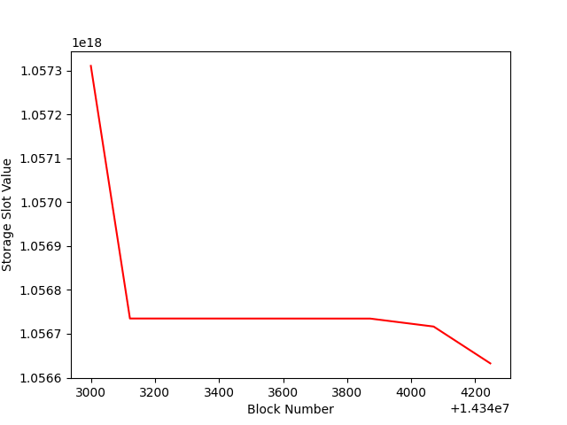
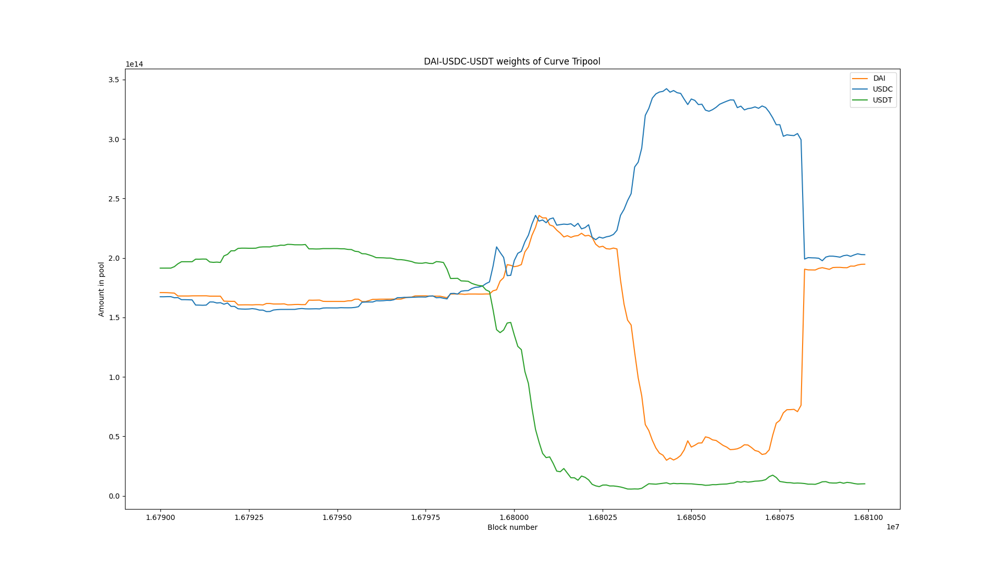

# sothis-plotter

Makes pretty plots from [sothis](https://github.com/rainshowerLabs/sothis) JSON output

## Installation

This tool is designed for Python 3.8+. Install the matplotlib dependency with:

```bash
pip3 install matplotlib
```

## Simple Example

You can test this tool on an example dataset from Uniswap V2 provided in this repository:
```bash
python3 plotter.py -i json_examples/univ2_eth_usdc.json -d
```



To generate a dataset similar to the example provided in this repository, run sothis to pull storage slot 0 ([`totalSupply`](https://evm.storage/eth/17715162/0xb4e16d0168e52d35cacd2c6185b44281ec28c9dc)) for the Uniswap v2 ETH/USDC pool:
```bash
sothis --mode fast_track --source_rpc https://eth.llamarpc.com --contract_address 0xb4e16d0168e52d35cacd2c6185b44281ec28c9dc --storage_slot 0 --origin_block 14343000 --terminal_block 14345000 --filename univ2_eth_usdc.json
```

## Advanced Example

The tripool_example directory contains data for a more advanced example. The tripool example uses sothis-plotter primarily to convert the sothis data to csv data. A separate Python script does the plotting for this special case where 3 input CSV files are used.

The steps to recreate this data are the following.

1. Identify the storage slot for the Curve tripool balances array

`cast keccak 0x0000000000000000000000000000000000000000000000000000000000000001`

Returns: 0xb10e2d527612073b26eecdfd717e6a320cf44b4afac2b0732d9fcbe2b7fa0cf6

DAI = 0xb10e2d527612073b26eecdfd717e6a320cf44b4afac2b0732d9fcbe2b7fa0cf6

USDC = 0xb10e2d527612073b26eecdfd717e6a320cf44b4afac2b0732d9fcbe2b7fa0cf7

USDT = 0xb10e2d527612073b26eecdfd717e6a320cf44b4afac2b0732d9fcbe2b7fa0cf8

2. Use sothis to collect tripool JSON data from blockchain. Pick your favorite RPC from https://chainlist.org/:

`sothis --mode fast_track --source_rpc https://eth.llamarpc.com --contract_address X --storage_slot 80084422859880547211683076133703299733277748156566366325829078699459944778998 --origin_block 17750000 --terminal_block 17800000 --query_interval 100 --filename tripool_dai.json`

`sothis --mode fast_track --source_rpc https://eth.llamarpc.com --contract_address X --storage_slot 80084422859880547211683076133703299733277748156566366325829078699459944778999 --origin_block 17750000 --terminal_block 17800000 --query_interval 100 --filename tripool_usdc.json`

`sothis --mode fast_track --source_rpc https://eth.llamarpc.com --contract_address X --storage_slot 80084422859880547211683076133703299733277748156566366325829078699459944779000 --origin_block 17750000 --terminal_block 17800000 --query_interval 100 --filename tripool_usdt.json`

3. Convert JSON data to csv:

`python3 plotter.py -i tripool_dai.json -d -c dai.csv`

`python3 plotter.py -i tripool_usdc.json -d -c usdc.csv`

`python3 plotter.py -i tripool_usdt.json -d -c usdt.csv`

4. Plot the csv files with the custom plotting script:

`python3 tripool_plot.py`

